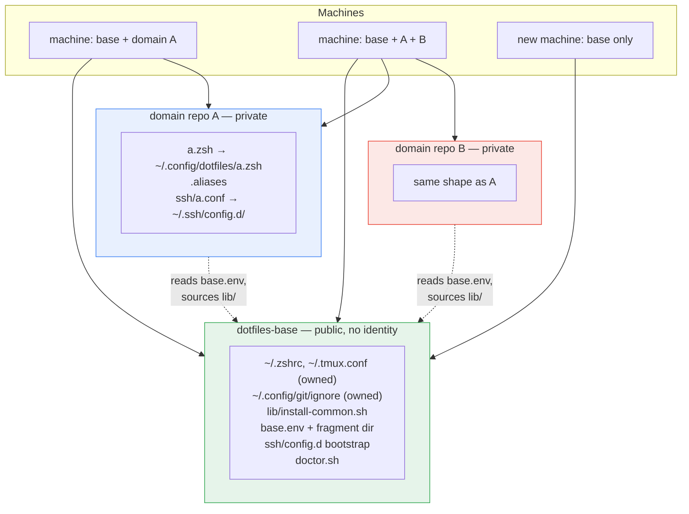

# Dotfiles architecture: base + domain repos

This repo is `dotfiles-base`. It owns the generic shell/tmux/git config that
every machine gets, and it owns the **seams** — the shared install code, the
extension points, and the checks that keep the pieces honest.

Around it sit any number of **domain repos** (personal, work, a client, …),
each holding only what is specific to one identity. A machine clones base plus
whichever domains it needs; nothing belonging to an unused domain ever touches
disk.

Base is public, so it contains no client names, no remotes, no identities, and
no keys. Each domain repo documents its own remote, identity, and install
steps in its own `README.md` — that way the documentation is present on every
machine that actually runs the thing it describes.

## What base owns

| Path | Ownership |
|---|---|
| `~/.zshrc`, `~/.tmux.conf` | symlinked outright; the only repo that touches them |
| `~/.config/git/ignore` | symlinked to `gitignore-global`; generic tooling noise |
| `~/.config/dotfiles/` | extension point — domains drop `<domain>.zsh` here |
| `~/.config/dotfiles/base.env` | records this clone's path so domains can find `lib/` |
| `~/.ssh/config.d/` | created + `Include` line appended to `~/.ssh/config` |
| `~/.gitconfig` | created empty if missing, then never touched again |
| `lib/install-common.sh` | shared `link()`, sourced by every domain's `install.sh` |

Base never references a domain by name.

## How domains plug in

**Shell.** Base's `.zshrc` loads every fragment in lexical order through one
generic hook:

```zsh
for fragment in "$HOME"/.config/dotfiles/*.zsh(N); do
  source "$fragment"
done
unset fragment
```

Each domain's `install.sh` symlinks its fragment to
`~/.config/dotfiles/<domain>.zsh`. Adding a domain needs no change to base.
Removing one means deleting the clone and its symlinks.

Fragments **self-locate** rather than hardcoding a clone path:

```zsh
DOMAIN_DIR="${${(%):-%x}:A:h}"   # resolves this file's symlink to its repo
source "$DOMAIN_DIR/.aliases"
```

**Install code.** Base's `install.sh` writes its own resolved location to
`~/.config/dotfiles/base.env`. Each domain's `install.sh` reads it, sources
`lib/install-common.sh`, and fails loudly if base has not been installed —
which is what makes "run base first" an enforced rule rather than a comment.

**SSH.** `Include ~/.ssh/config.d/*.conf` is a glob, so a domain just drops
`ssh/<domain>.conf` in; nothing to append or remove.

**Git identity** is machine-local and owned by no repo. Each machine adds its
own `includeIf` blocks to `~/.gitconfig`.



Private keys (`id_ed25519_*`, `.pem`) are never committed to any repo — they
move between machines out of band.

## Quickstart

```bash
# base, always first
git clone <base-remote> ~/Documents/.dotfiles-base
~/Documents/.dotfiles-base/install.sh

# then any domain, in any order (see that repo's README for its remote)
git clone <domain-remote> ~/Documents/.dotfiles-<domain>
~/Documents/.dotfiles-<domain>/install.sh

exec zsh
```

Base alone gives a working shell and tmux with no identity attached.

**Removing a domain:**

```bash
rm -rf ~/Documents/.dotfiles-<domain> \
       ~/.config/dotfiles/<domain>.zsh \
       ~/.ssh/config.d/<domain>.conf
exec zsh
```

## doctor.sh

Every defect this architecture has actually suffered was invisible on the
machine where it was introduced and only broke on the next one. `doctor.sh`
checks that class:

```bash
~/Documents/.dotfiles-base/doctor.sh
```

1. Every installed symlink resolves, and base still owns its files.
2. `base.env` exists, matches this clone, and its target has `lib/`.
3. Domain repos behind the fragments are reachable.
4. No alias name is defined in two repos — lexical load order picks the winner
   silently, so a collision means one repo quietly overrides another. Base is
   included, since it loads before every fragment.
5. The same command is not aliased under two different names — that is how one
   alias file ends up with a near-twin of another's.
6. No alias points at a file inside a repo that no longer exists.
7. `core.excludesFile` is unset. Setting it shadows `~/.config/git/ignore`
   silently, and its value is an absolute path that means nothing on the next
   machine.

Nothing installs it and nothing runs it automatically — it reports, it does not
mutate. Run it when something feels off, and after adding a domain.

### Per-machine check when adopting this layout

On a machine that predates this layout, verify once by hand:

```bash
git config --global core.excludesFile   # expect: no output
```

If it prints a path, an older setup is shadowing `~/.config/git/ignore`:

```bash
git config --global --unset core.excludesFile
```

This is deliberately **not** in `install.sh`: a fresh machine has nothing to
unset (`--unset` exits 5 there, which would abort the installer), and a machine
that set it on purpose should not have it silently removed.
